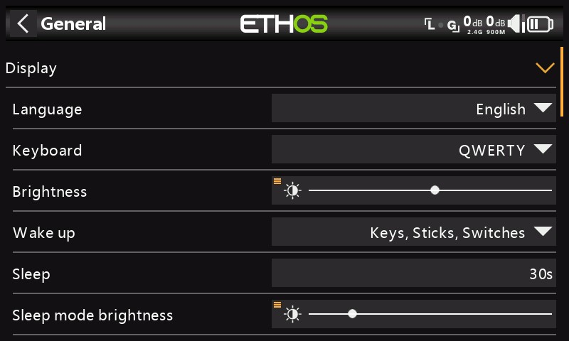
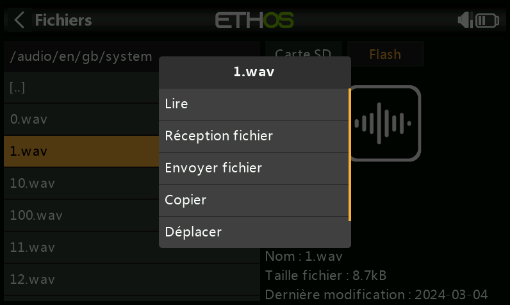
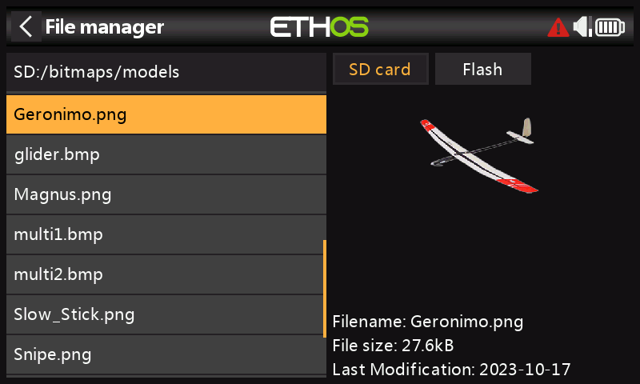
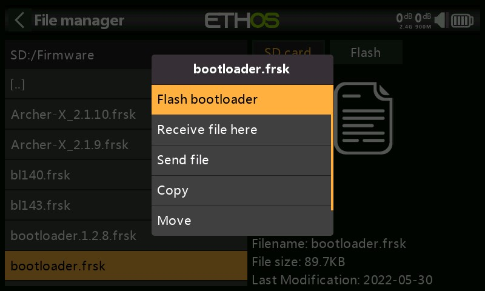

# Configuration du système

Le menu « Configuration du système » est utilisé pour configurer les parties du matériel du système radio qui sont communes à tous les modèles, et est accessible en sélectionnant l'onglet Engrenage en bas de l'écran. À l'inverse, la configuration spécifique au modèle est effectuée dans le menu Modèle, auquel vous pouvez accéder en sélectionnant l'onglet Avion en bas de l'écran.

Veuillez noter que les paramètres permettant de déterminer si le module RF interne ou externe est utilisé sont spécifiques au modèle, ils sont donc gérés dans la section « Système RF » du menu Modèle.

#### Aperçu 

.png>)

Dans le programme de configuration du système, appuyez sur une vignette pour configurer la section sélectionnée ou utilisez le sélecteur rotatif pour déplacer la surbrillance vers la vignette souhaitée, puis appuyez sur Entrée. Vous pouvez balayer vers la gauche pour accéder à la deuxième page de fonctions ou utiliser le sélecteur rotatif pour déplacer la surbrillance vers la deuxième page.

**Gestionnaire de fichiers**

Le gestionnaire de fichiers permet de gérer les fichiers et d'accéder au micrologiciel flash au module RF interne, au S.Port externe, à l'OTA (Over The Air) et aux modules externes.

**Alertes**

Configuration du mode silencieux, des tensions de la batterie radio et RTC, des conflits de capteurs et des alertes d'inactivité.

**Date et heure**

Configuration de l'horloge système et des options d'affichage de l'heure.

**Généralités**

Pour configurer le style de menu, la langue du système et les attributs de l'écran LCD tels que la luminosité et le rétroéclairage, ainsi que les modes et paramètres audio, vario et haptique. De plus, les options de la barre d'outils supérieure, la sélection du modèle à la mise sous tension et la présélection du mode USB peuvent être configurées.

**Batterie**

Configuration des paramètres de gestion de la batterie.

**Matériel**

Cette section permet de vérifier les périphériques d'entrée physiques matériels, ainsi que l'étalonnage des entrées analogiques et du gyroscope. Il permet également de modifier les affectations des inters et de définir les fonctions du bouton d'accueil.

**Manches**

Configuration du mode manches et de l'ordre des voies par défaut. Les 4 manches peuvent également être renommées.

**Capteurs**

Outils de configuration d'appareils tels que les capteurs, les récepteurs, la suite de gaz, les servos et les émetteurs vidéo.

**Info**

Informations système pour la version du micrologiciel, les types de cardans et les modules RF.

#### Gestionnaire de fichiers 

.png>)(fr)

Le « gestionnaire de fichiers » permet de gérer les fichiers et les dossiers, et l'accès au micrologiciel flash du module RF, des ports S.Port externes, des appareils OTA (Over The Air) et des modules externes.

Notez que lors de la mise à jour du micrologiciel du système, les fichiers de la clé USB et de la carte SD ou eMMC peuvent également avoir besoin d'être mis à jour.

ETHOS dispose d'une fonction de transfert de fichiers Bluetooth radio-radio. Reportez-vous à l'exemple de la section Partage de fichiers via Bluetooth ci-dessous.

Appuyez sur « Gestionnaire de fichiers » pour ouvrir l'explorateur de fichiers.

\
.png>)

Le radio utilise une clé USB virtuelle interne pour stocker les bitmaps et les polices du système. Appuyez sur l'onglet « Flash » pour explorer la mémoire flash (voir la capture d'écran ci-dessus).

Lorsqu'il est connecté à un PC :

Clé USB (lettre de lecteur)/bitmaps/système

(les cartes de bits utilisées pour les affichages à l'écran et les icônes sont stockées ici)

Clé USB (lettre de lecteur)/fonts/

(les polices sont utilisées pour les différentes sélections de langue)

La série X20/S/HD nécessite une carte SD de 32 Go ou moins formatée en FAT32. Les cartes SanDisk Ultra Micro SDHC Class 10 32 Go sont une bonne option. Les fichiers seront disponibles sur le site Web de FRSky.

.jpeg>)

Les radios X18 et X20 Pro/R/RS utilisent une carte eMMC interne pour le stockage des fichiers par défaut, mais une carte SD externe peut être ajoutée. Appuyez sur l'onglet « Radio » pour explorer la mémoire de la carte eMMC.

Le système créera certains des dossiers si l'utilisateur ne les crée pas, comme les journaux, les modèles et les captures d'écran. Le dossier Firmware a été créé manuellement pour conserver le firmware de l'appareil comme les récepteurs, etc.

Chemin d'accès au lecteur de la carte SD lorsqu'il est connecté à un PC :

Carte SD (lettre de lecteur)/ ou

RADIO (lettre de lecteur)/ {radios avec carte eMMC interne}

Les dossiers de niveau supérieur sont les suivants :

**audio/**

Ce dossier est destiné aux fichiers audio.

**audio/fr/femme** Voix féminine\
**audio/fr/homme** Voix masculine\
**audio/fr/default** Voix masculine

Ces dossiers sont destinés aux fichiers audios de l'utilisateur, qui peuvent être lus par la fonction spéciale « Lire audio ». Reportez-vous à la section Modèle / Fonctions spéciales et aussi la section Choix des voies.

Le format doit être 16 kHz ou 32 kHz PCM linéaire 16 bits ou alaw (EU) 8 bits ou mulaw (US) 8 bits. Il peut y avoir 31 caractères dans les noms des fichiers wav plus l'extension.

**audio/fr/femme/system**\
**audio/fr/homme/system**

**audio/fr/default/system**\

Ces dossiers sont destinés aux fichiers audios du système, par ex.

| hello.wav | Le message d'accueil « Bienvenue chez Ethos »                                             |
| --------- | ----------------------------------------------------------------------------------------- |
| bye.wav   | Ce n'est pas fourni par Ethos, mais vous pouvez ajouter votre propre fichier WAV d'adieu. |

Appuyez sur le dossier \[audio] pour afficher le contenu du dossier.

(fr)

Appuyez sur un fichier WAV et sélectionnez l'option Lecture pour l'écouter.

Le fichier peut également être copié, déplacé ou supprimé. Il existe également des options pour envoyer ou recevoir le fichier via Bluetooth. Veuillez-vous référer à la section Partage de fichiers via Bluetooth ci-dessous.

Remarque : Les trois dossiers sont mis à jour par Ethos Suite, quel que soit le dossier que vous avez sélectionné dans les options vocales.

bitmaps**/**

Ce dossier est destiné aux fichiers bitmap.

**bitmaps/models/**

Ce dossier est destiné aux images de modèle utilisateur configurées dans « Modèle / Modifier le modèle » et les assistants de nouveau modèle.

**bitmaps/users/**

Ce dossier est destiné aux bitmaps utilisateur autres que les images de modèle configurées dans 'Modèle / Modifier le modèle'.

Le format d'image recommandé est le format BMP suivant :

Format BMP 32 bits

8 bits par couleur

Canal alpha (utilisé pour la transparence de l'image) Taille : 300x280px

Ce format réduit la charge de calcul sur le microcontrôleur embarqué de la radio. De plus, ETHOS redimensionnera les BMP à la volée, mais pas les formats PNG ou JPG.

Règles de nommage des fichiers image :

Règle 1 : n'utilisez que les caractères suivants : A-Z, a-z, 0-9, () !-\_@# ; \[]+= et Règle d'espace 2 : le nom ne doit pas contenir plus de 11 caractères, plus 4 pour l'extension. Si le nom comporte plus de 11 caractères, il s'affiche dans le Gestionnaire de fichiers, mais n'apparaît pas dans l'interface de sélection d'image du modèle.

**Outils de conversion d'images**

Il existe des outils de conversion d'images utiles :

1. **Basé sur Windows**
2. [https://github.com/Ceeb182/ConvertToETHOSBMPformat](https://github.com/Ceeb182/ConvertToETHOSBMPformat)\
   (Cet utilitaire applique également les règles de nommage des fichiers.)
3. **Basé sur le Web**

[https://ethosbmp.hobby4life.nl/](https://ethosbmp.hobby4life.nl/)

**documents/**

Ce dossier est destiné aux documents.\
_**documents**_/_**user**_/

Ce dossier est destiné aux documents texte de l'utilisateur. Ils peuvent être appelés dans le widget 'Texte'.

**Firmware/**

Ce dossier est destiné aux fichiers du micrologiciel. Les mises à jour du micrologiciel pour le module RF interne, les modules externes et d'autres appareils tels que les récepteurs, etc. sont stockées ici. Ils peuvent ensuite être flashés à partir d'ici via le S.Port externe de la radio, ou OTA (Over The Air). Le nouveau firmware doit être copié dans le dossier Firmware après avoir placé la radio en mode bootloader et connecté à un PC via USB.

.jpeg>)

Appuyez sur le dossier Firmware pour afficher les fichiers du firmware qui ont été copiés dans ce dossier. Appuyez ensuite sur l'option Flash dans la boîte de dialogue contextuelle. L'exemple ci-dessus montre le module RF interne en cours de mise à jour.

.jpeg>)

L'exemple ci-dessus montre un récepteur S8R sur le point d'être mis à jour via la connexion S.Port de la radio.

.jpeg>)

L'exemple ci-dessus montre un récepteur TD-R18 sur le point d'être mis à jour Over-The-Air via la liaison sans fil vers le récepteur lié.

L'exemple ci-dessus montre la mise à jour du bootloader de la radio.

Les fichiers peuvent également être copiés, déplacés ou supprimés.

_**I18n**_

Ce dossier contient les fichiers de traduction de la langue.

_**Logs/**_

Les journaux de données y sont stockés.

_**models/**_

La radio stocke les fichiers de modèles ici. Ces fichiers ne peuvent pas être modifiés par l'utilisateur, mais peuvent être sauvegardés ou partagés à partir d'ici. Initialement, les modèles étaient simplement nommés à partir de model01.bin, mais à partir d'Ethos v1.2.11, le nom du modèle est utilisé, par exemple un modèle nommé 'Extra' aura un nom de fichier de 'Extra.bin'. S'il y a plus d'un 'Extra', les modèles supplémentaires seront nommés 'Extra01.bin', etc.

Lors de la modification des noms de modèle dans l'écran « Modifier le modèle », le nom de fichier du modèle (.bin) sera également modifié. Le nom de fichier du modèle sera en minuscules (le nom réel du modèle avec les majuscules et les minuscules est enregistré dans le \*\*\*.bin). Tous les caractères ne sont pas pris en charge pour le nom de groupe du fichier modèle, il est donc possible qu'il ne corresponde pas exactement au nom du modèle.

À partir de la version 1.1.0 Alpha 17, il existe des sous-dossiers pour chaque dossier de catégorie de modèle créé par l'utilisateur.

_**screenshots**_

Les captures d'écran créées par la fonction spéciale Capture d'écran sont stockées ici. Reportez-vous à la section Modèle / Fonctions spéciales .

_**scripts/**_

Ce dossier est utilisé pour stocker les scripts Lua. Les scripts peuvent être organisés dans des dossiers individuels.

Veuillez noter que les scripts Lua augmentent le temps de démarrage de la radio. S'ils sont mis en œuvre correctement, le retard ne devrait pas être perceptible, mais si ce n'est pas le cas, le retard peut être presque indéfini.

_**Scripts pour modules externes**_

Chaque module externe tiers possède son propre fichier Lua et doit être stocké dans son propre dossier.\
scripts/multi\
scripts/elrs\
scripts/ghosts\
scripts/crossfire

Veuillez-vous référer à la section [Modules externes tiers](https://www.rcgroups.com/forums/showpost.php?p=49550649\&postcount=18844) postez sur le fil X20 et Ethos sur rcgroups pour plus d'informations.

_**radio.bin**_

Ce fichier se trouve dans le dossier racine et est créé par le système de la radio lorsqu'il initialise et conserve les paramètres système. Il doit être sauvegardé avec le dossier models ci-dessus avant de mettre à jour le micrologiciel, pour permettre une rétrogradation vers la version antérieure si nécessaire.

Le fichier de mise à jour du micrologiciel firmware.bin doit être enregistré ici dans le dossier racine de la carte SD ou de l'eMMC lors d'une mise à jour du micrologiciel radio. Après avoir enregistré le nouveau fichier firmware.bin, la mise à jour sera automatiquement flashée dans la radio lorsqu'elle sera déconnectée du PC. (Veuillez noter que vous devrez peut-être également mettre à jour le contenu de la carte SD ou de l'eMMC et de la clé USB radio en même temps.)

_**sdcard.version**_

Ce fichier contient la version carte SD et est utilisé et maintenu par Ethos Suite.
