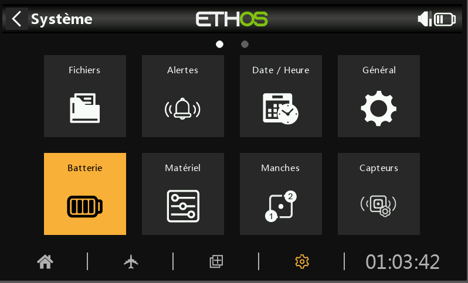
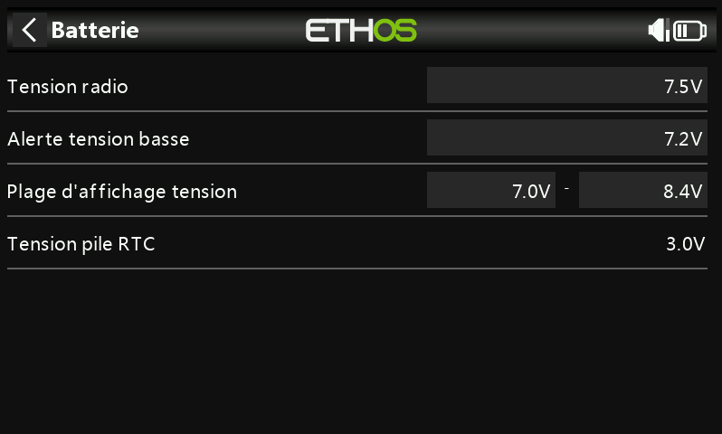

# Batterie

(fr)

(fr)

La section Batterie permet de calibrer la batterie et la pile de la radio et de régler les seuils d'alarme.

**Tension radio**

La « tension principale » affiche la tension actuelle de la batterie, mais il s'agit également du réglage de l'étalonnage de la tension de la batterie. Vous pouvez entrer la tension réelle de la batterie mesurée à l'aide d'un multimètre. La valeur par défaut est de 8,4 V pour une batterie LIPO 2S chargée.

**Alerte tension basse**

Il s'agit de la tension de seuil d'alarme. La valeur par défaut est de 7,2 V. Une valeur de 7,4 V donnerait une marge de sécurité supplémentaire.

Une alerte vocale « La batterie de la radio est faible » sera émise lorsque la vérification de la « Tension principale » est activée dans Système / Alertes / La tension principale et la batterie principale de la radio sont inférieures au seuil défini ici.

_**Avertissement!**_

Lorsque cette alerte est donnée, il est prudent d'atterrir et de charger la batterie de la radio !

Veuillez noter que lorsque la tension de la batterie de la radio tombe à 6,0 V, la radio s'éteint malgré tout pour protéger la batterie LiIon (2 x 3,0 V) !

**Plage d’affichage tension**

Ces paramètres définissent la portée de l'affichage graphique de la batterie en haut à droite de l'écran. Les limites de portée par défaut de la batterie Li-Ion intégrée sont de 6,4 et 8,4 V. De nombreux pilotes augmentent la tension de détection inférieure pour déclencher l'alerte de faible tension TX plus tôt et éviter de trop décharger leur batterie TX.

Si la batterie est remplacée par un autre type, les limites doivent être réglées de manière appropriée.

**Tension pile RTC**

Affiche la tension de la batterie RTC (Real Time Clock) dans la radio. La tension est de 3,0 V pour une batterie neuve. Si la tension est inférieure à 2,7 V, veuillez remplacer la pile à l'intérieur de la radio pour vous assurer que l'horloge fonctionne correctement. Si la tension descend en dessous de 2,5 V et qu'une alerte sera donnée, veuillez-vous référer à Alertes / tension RTC.
