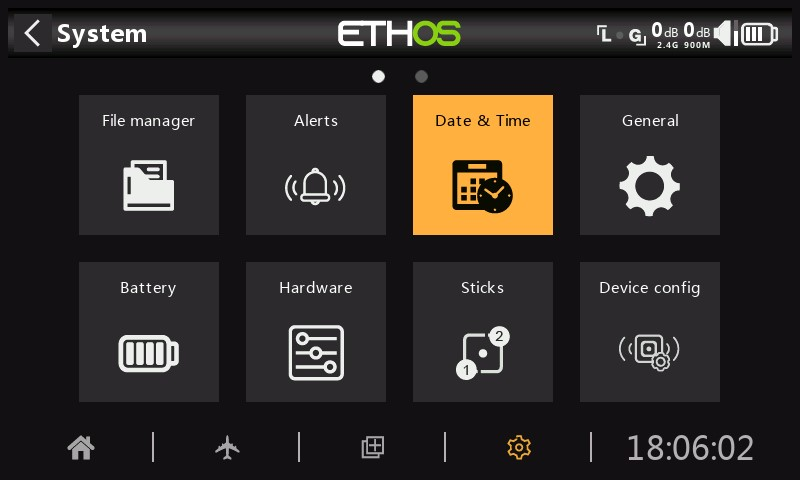

# Date et heure

Les paramètres de date et d'heure sont les suivants :

**Délai de 24 heures**

L'horloge s'affiche au format 24 heures lorsqu'elle est activée.

**Affichage des secondes**

L'horloge affichera les secondes lorsqu'elle sera activée.

**Date**

Doit être défini sur la date du jour. Ceci est utilisé dans les journaux.

**Heure**

Doit être réglé sur l'heure actuelle. Ceci est utilisé dans les journaux.

**Fuseau horaire**

Permet de configurer le fuseau horaire de l'utilisateur.

**Ajuster la vitesse RTC**

L'horloge en temps réel peut être calibrée pour compenser toute dérive de l'horloge, jusqu'à 41 secondes par jour.

Pour l'étalonnage, calculez combien de secondes votre horloge gagne ou perd en 24 heures.

Réglez la valeur d'étalonnage sur 12 fois ce nombre de secondes, ce qui la rend négative si votre horloge est rapide et positive si elle est lente. Pour une meilleure précision, vous pouvez ensuite vérifier si votre horloge est précise et ajuster légèrement la valeur d'étalonnage. La valeur d'étalonnage réelle peut être réglée entre -500 et +500.

**Réglage automatique à partir du GPS**

Lorsqu'elle est activée, l'heure et la date seront automatiquement réglées à partir des données du capteur GPS à distance.
