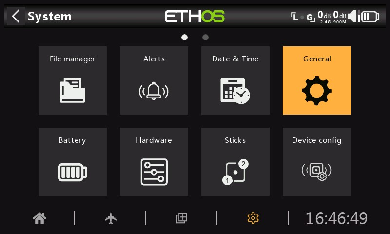
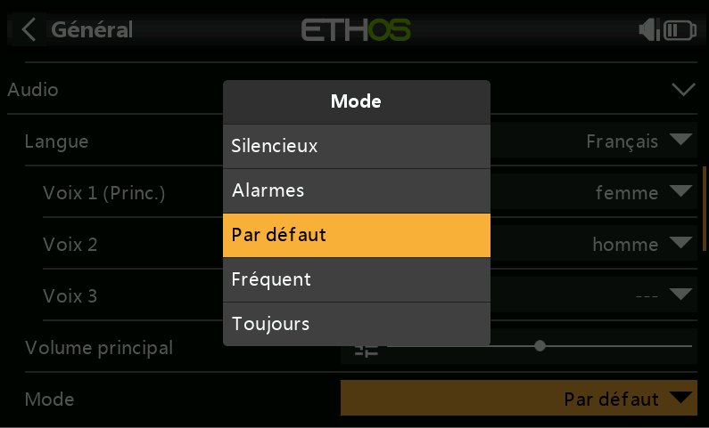
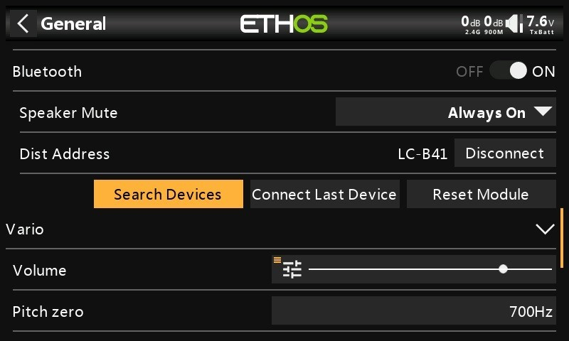

# Gestionnaire de fichiers

#### Gestionnaire de fichiers 

.png>)(fr)

Le « gestionnaire de fichiers » permet de gérer les fichiers et les dossiers, et l'accès au micrologiciel flash du module RF, des ports S.Port externes, des appareils OTA (Over The Air) et des modules externes.

Notez que lors de la mise à jour du micrologiciel du système, les fichiers de la clé USB et de la carte SD ou eMMC peuvent également avoir besoin d'être mis à jour.

ETHOS dispose d'une fonction de transfert de fichiers Bluetooth radio-radio. Reportez-vous à l'exemple de la section Partage de fichiers via Bluetooth ci-dessous.

Appuyez sur « Gestionnaire de fichiers » pour ouvrir l'explorateur de fichiers.

\
.png>)

Le radio utilise une clé USB virtuelle interne pour stocker les bitmaps et les polices du système. Appuyez sur l'onglet « Flash » pour explorer la mémoire flash (voir la capture d'écran ci-dessus).

Lorsqu'il est connecté à un PC :

Clé USB (lettre de lecteur)/bitmaps/système

(les cartes de bits utilisées pour les affichages à l'écran et les icônes sont stockées ici)

Clé USB (lettre de lecteur)/fonts/

(les polices sont utilisées pour les différentes sélections de langue)

.jpeg>)

La série X20/S/HD nécessite une carte SD de 32 Go ou moins formatée en FAT32. Les cartes SanDisk Ultra Micro SDHC Class 10 32 Go sont une bonne option. Les fichiers seront disponibles sur le site Web de FRSky.

.jpeg>)

Les radios X18 et X20 Pro/R/RS utilisent une carte eMMC interne pour le stockage des fichiers par défaut, mais une carte SD externe peut être ajoutée. Appuyez sur l'onglet « Radio » pour explorer la mémoire de la carte eMMC.

Le système créera certains des dossiers si l'utilisateur ne les crée pas, comme les journaux, les modèles et les captures d'écran. Le dossier Firmware a été créé manuellement pour conserver le firmware de l'appareil comme les récepteurs, etc.

Chemin d'accès au lecteur de la carte SD lorsqu'il est connecté à un PC :

Carte SD (lettre de lecteur)/ ou

RADIO (lettre de lecteur)/ {radios avec carte eMMC interne}

Les dossiers de niveau supérieur sont les suivants :

**audio/**

Ce dossier est destiné aux fichiers audio.

**audio/fr/femme** Voix féminine\
**audio/fr/homme** Voix masculine\
**audio/fr/default** Voix masculine

Ces dossiers sont destinés aux fichiers audios de l'utilisateur, qui peuvent être lus par la fonction spéciale « Lire audio ». Reportez-vous à la section Modèle / Fonctions spéciales et aussi la section Choix des voies.

Le format doit être 16 kHz ou 32 kHz PCM linéaire 16 bits ou alaw (EU) 8 bits ou mulaw (US) 8 bits. Il peut y avoir 31 caractères dans les noms des fichiers wav plus l'extension.

**audio/fr/femme/system**\
**audio/fr/homme/system**

**audio/fr/default/system**\

Ces dossiers sont destinés aux fichiers audios du système, par ex.

| hello.wav | Le message d'accueil « Bienvenue chez Ethos »                                             |
| --------- | ----------------------------------------------------------------------------------------- |
| bye.wav   | Ce n'est pas fourni par Ethos, mais vous pouvez ajouter votre propre fichier WAV d'adieu. |

Appuyez sur le dossier \[audio] pour afficher le contenu du dossier.

(fr)

Appuyez sur un fichier WAV et sélectionnez l'option Lecture pour l'écouter.

Le fichier peut également être copié, déplacé ou supprimé. Il existe également des options pour envoyer ou recevoir le fichier via Bluetooth. Veuillez-vous référer à la section Partage de fichiers via Bluetooth ci-dessous.

Remarque : Les trois dossiers sont mis à jour par Ethos Suite, quel que soit le dossier que vous avez sélectionné dans les options vocales.

bitmaps**/**

Ce dossier est destiné aux fichiers bitmap.

**bitmaps/models/**

.png>)

Ce dossier est destiné aux images de modèle utilisateur configurées dans « Modèle / Modifier le modèle » et les assistants de nouveau modèle.

**bitmaps/users/**

Ce dossier est destiné aux bitmaps utilisateur autres que les images de modèle configurées dans 'Modèle / Modifier le modèle'.

Le format d'image recommandé est le format BMP suivant :

Format BMP 32 bits

8 bits par couleur

Canal alpha (utilisé pour la transparence de l'image) Taille : 300x280px

Ce format réduit la charge de calcul sur le microcontrôleur embarqué de la radio. De plus, ETHOS redimensionnera les BMP à la volée, mais pas les formats PNG ou JPG.

Règles de nommage des fichiers image :

Règle 1 : n'utilisez que les caractères suivants : A-Z, a-z, 0-9, () !-\_@# ; \[]+= et Règle d'espace 2 : le nom ne doit pas contenir plus de 11 caractères, plus 4 pour l'extension. Si le nom comporte plus de 11 caractères, il s'affiche dans le Gestionnaire de fichiers, mais n'apparaît pas dans l'interface de sélection d'image du modèle.

**Outils de conversion d'images**

Il existe des outils de conversion d'images utiles :

1. **Basé sur Windows**
2. [https://github.com/Ceeb182/ConvertToETHOSBMPformat](https://github.com/Ceeb182/ConvertToETHOSBMPformat)\
   (Cet utilitaire applique également les règles de nommage des fichiers.)
3. **Basé sur le Web**

[https://ethosbmp.hobby4life.nl/](https://ethosbmp.hobby4life.nl/)

**documents/**

Ce dossier est destiné aux documents.\
_**documents**_/_**user**_/

Ce dossier est destiné aux documents texte de l'utilisateur. Ils peuvent être appelés dans le widget 'Texte'.

**Firmware/**

Ce dossier est destiné aux fichiers du micrologiciel. Les mises à jour du micrologiciel pour le module RF interne, les modules externes et d'autres appareils tels que les récepteurs, etc. sont stockées ici. Ils peuvent ensuite être flashés à partir d'ici via le S.Port externe de la radio, ou OTA (Over The Air). Le nouveau firmware doit être copié dans le dossier Firmware après avoir placé la radio en mode bootloader et connecté à un PC via USB.

.jpeg>)

Appuyez sur le dossier Firmware pour afficher les fichiers du firmware qui ont été copiés dans ce dossier. Appuyez ensuite sur l'option Flash dans la boîte de dialogue contextuelle. L'exemple ci-dessus montre le module RF interne en cours de mise à jour.

.jpeg>)

L'exemple ci-dessus montre un récepteur S8R sur le point d'être mis à jour via la connexion S.Port de la radio.

.jpeg>)

L'exemple ci-dessus montre un récepteur TD-R18 sur le point d'être mis à jour Over-The-Air via la liaison sans fil vers le récepteur lié.

L'exemple ci-dessus montre la mise à jour du bootloader de la radio.

Les fichiers peuvent également être copiés, déplacés ou supprimés.

_**I18n**_

Ce dossier contient les fichiers de traduction de la langue.

_**Logs/**_

Les journaux de données y sont stockés.

_**models/**_

La radio stocke les fichiers de modèles ici. Ces fichiers ne peuvent pas être modifiés par l'utilisateur, mais peuvent être sauvegardés ou partagés à partir d'ici. Initialement, les modèles étaient simplement nommés à partir de model01.bin, mais à partir d'Ethos v1.2.11, le nom du modèle est utilisé, par exemple un modèle nommé 'Extra' aura un nom de fichier de 'Extra.bin'. S'il y a plus d'un 'Extra', les modèles supplémentaires seront nommés 'Extra01.bin', etc.

Lors de la modification des noms de modèle dans l'écran « Modifier le modèle », le nom de fichier du modèle (.bin) sera également modifié. Le nom de fichier du modèle sera en minuscules (le nom réel du modèle avec les majuscules et les minuscules est enregistré dans le \*\*\*.bin). Tous les caractères ne sont pas pris en charge pour le nom de groupe du fichier modèle, il est donc possible qu'il ne corresponde pas exactement au nom du modèle.

À partir de la version 1.1.0 Alpha 17, il existe des sous-dossiers pour chaque dossier de catégorie de modèle créé par l'utilisateur.

_**screenshots**_

Les captures d'écran créées par la fonction spéciale Capture d'écran sont stockées ici. Reportez-vous à la section Modèle / Fonctions spéciales .

_**scripts/**_

Ce dossier est utilisé pour stocker les scripts Lua. Les scripts peuvent être organisés dans des dossiers individuels.

Veuillez noter que les scripts Lua augmentent le temps de démarrage de la radio. S'ils sont mis en œuvre correctement, le retard ne devrait pas être perceptible, mais si ce n'est pas le cas, le retard peut être presque indéfini.

_**Scripts pour modules externes**_

Chaque module externe tiers possède son propre fichier Lua et doit être stocké dans son propre dossier.\
scripts/multi\
scripts/elrs\
scripts/ghosts\
scripts/crossfire

Veuillez-vous référer à la section [Modules externes tiers](https://www.rcgroups.com/forums/showpost.php?p=49550649\&postcount=18844) postez sur le fil X20 et Ethos sur rcgroups pour plus d'informations.

_**radio.bin**_

Ce fichier se trouve dans le dossier racine et est créé par le système de la radio lorsqu'il initialise et conserve les paramètres système. Il doit être sauvegardé avec le dossier models ci-dessus avant de mettre à jour le micrologiciel, pour permettre une rétrogradation vers la version antérieure si nécessaire.

Le fichier de mise à jour du micrologiciel firmware.bin doit être enregistré ici dans le dossier racine de la carte SD ou de l'eMMC lors d'une mise à jour du micrologiciel radio. Après avoir enregistré le nouveau fichier firmware.bin, la mise à jour sera automatiquement flashée dans la radio lorsqu'elle sera déconnectée du PC. (Veuillez noter que vous devrez peut-être également mettre à jour le contenu de la carte SD ou de l'eMMC et de la clé USB radio en même temps.)

_**sdcard.version**_

Ce fichier contient la version carte SD et est utilisé et maintenu par Ethos Suite.

### Partage de fichiers via Bluetooth

ETHOS dispose d'une fonction de transfert de fichiers Bluetooth radio-radio.

.png>)

Sur la radio de réception, à l'aide du Gestionnaire de fichiers, accédez au dossier du modèle dans lequel vous souhaitez recevoir le modèle. Appuyez longuement sur Entrée et sélectionnez « Recevoir le fichier ici ».

.png>)

Sur la radio qui envoie, accédez au fichier que vous souhaitez envoyer et appuyez dessus. Sélectionnez ensuite « Envoyer le fichier » et suivez les instructions sur les deux radios.

Si la radio est déjà connectée à un autre appareil Bluetooth sous Télémétrie / Bluetooth ou Trainer / Mode de liaison / Bluetooth ou Général / Audio / Bluetooth (X20S/Pro uniquement), il vous sera demandé si vous souhaitez déconnecter cet appareil.

#### Alertes 

(fr).png>)(fr)

Les alertes système sont les suivantes :

**Mode silencieux**

Une alerte « Mode silencieux » sera émise au démarrage lorsque la vérification « Mode silencieux » est activée et que le « Mode audio » a été réglé sur Silencieux en mode Système / Général / Audio

**Tension principale**

Une alerte vocale « La batterie de la radio est faible » est émise lorsque la vérification de la « Tension principale » est activée et que la batterie de la radio principale est inférieure au seuil défini dans le paramètre « Basse tension » dans Système / Batterie.

**Tension pile RTC**

Une alerte vocale « La batterie RTC est faible » sera émise lorsque la vérification de la « tension RTC » est activée et que la pile bouton RTC est inférieure à 2,5 V, le seuil de batterie RTC par défaut. Il peut être éteint jusqu'à ce que la batterie RTC ait été remplacée, mais ne doit pas être laissé éteint indéfiniment. Le temps réel est utilisé dans l'enregistrement des données, et une heure invalide entraînera des difficultés dans la lecture des journaux, en particulier pour distinguer les sessions de vol.

**Avertissement de conflit de capteur**

La détection des conflits de capteurs peut être désactivée. Cela ne devrait être nécessaire que si vous avez des capteurs qui ne répondent pas à la spécification S.Port.

**Inactivité**

Une alerte vocale « Radio inactive » sera émise lorsque la radio n'a pas été utilisée pendant plus longtemps que la durée « Inactivité », ainsi qu'une vibration au cas où le volume de la radio serait complètement baissé. La valeur par défaut est de 10 minutes.

#### Date et heure 

.jpeg>).jpeg>)

Les paramètres de date et d'heure sont les suivants :

**Délai de 24 heures**

L'horloge s'affiche au format 24 heures lorsqu'elle est activée.

**Affichage des secondes**

L'horloge affichera les secondes lorsqu'elle sera activée.

**Date**

Doit être défini sur la date du jour. Ceci est utilisé dans les journaux.

**Heure**

Doit être réglé sur l'heure actuelle. Ceci est utilisé dans les journaux.

**Fuseau horaire**

Permet de configurer le fuseau horaire de l'utilisateur.

**Ajuster la vitesse RTC**

L'horloge en temps réel peut être calibrée pour compenser toute dérive de l'horloge, jusqu'à 41 secondes par jour.

Pour l'étalonnage, calculez combien de secondes votre horloge gagne ou perd en 24 heures.

Réglez la valeur d'étalonnage sur 12 fois ce nombre de secondes, ce qui la rend négative si votre horloge est rapide et positive si elle est lente. Pour une meilleure précision, vous pouvez ensuite vérifier si votre horloge est précise et ajuster légèrement la valeur d'étalonnage. La valeur d'étalonnage réelle peut être réglée entre -500 et +500.

**Réglage automatique à partir du GPS**

Lorsqu'elle est activée, l'heure et la date seront automatiquement réglées à partir des données du capteur GPS à distance.

#### Généralités 

Les éléments suivants peuvent être configurés ici :

* Attributs de l'écran LCD
* Les paramètres audio
* Les réglages vario
* Les paramètres de retour haptique
* La barre d'outils supérieure

**Attributs d'affichage**

Les attributs de l'écran LCD peuvent être configurés ici :

.jpeg>)

**Langue**

Les langues suivantes sont prises en charge pour les menus d'affichage :

* English
* 中文
* Česky
* Deutsch
* Español
* Français
* עִברִית
* Italiano
* Nederlands
* Norsk
* Português Brasileiro
* Polish
* Português

**Clavier**

Permet de choisir entre les dispositions de clavier virtuel QWERTY, QWERTZ et AZERTY.

**Luminosité**

Utilisez le curseur pour contrôler la luminosité de l'écran, de gauche à droite pour régler la luminosité de sombre à clair. Appuyez longuement sur \[ENT] pour afficher les options permettant d'utiliser une source ou de la régler au minimum ou au maximum.

Veuillez noter que si Luminosité (pour le rétroéclairage activé) = « Luminosité du mode veille » (pour le rétroéclairage désactivé), l'écran tactile reste actif.

**Option potentiomètre**

.jpeg>)

Appuyez sur « Utiliser une source », puis sélectionnez un potentiomètre à utiliser comme contrôle de la luminosité.

L'exemple ci-dessus montre que la luminosité est contrôlée via le potentiomètre 1.

**Mise en veille**

.png>)(fr)

Le rétroéclairage de l'écran peut être réveillé de l'état de veille conformément à une ou plusieurs des options suivantes :

_**Toujours**_

Le rétroéclairage reste allumé en permanence.

_**Manches**_

Le rétroéclairage s'allume lorsque vous actionnez des manches ou des touches.

_**Inters**_

Le rétroéclairage s'allume lorsque des interrupteurs ou des touches sont actionnés.

**Gyro**

Le rétroéclairage s'allume lorsque vous inclinez la radio ou lorsque vous actionnez les touches.

Notez que plusieurs options peuvent être activées.

_**Veille**_

Durée d'inactivité avant la désactivation du rétroéclairage. Lorsque vous sélectionnez « Toujours » comme option d'affichage « Réveil », l'option Veille est grisée.

**Luminosité du mode veille**

.jpeg>)(fr)

Utilisez le curseur pour contrôler la luminosité de l'écran en mode veille, de gauche à droite pour régler la luminosité de sombre à clair.

Veuillez noter que si Luminosité (pour le rétroéclairage activé) = « Luminosité du mode veille » (pour le rétroéclairage désactivé), l'écran tactile reste actif.

_**Mode sombre**_

Permet de choisir entre les modes clair et sombre pour l'affichage.

**Couleur de surbrillance**

Permet de sélectionner la couleur de surbrillance à utiliser dans l'affichage. La valeur par défaut est jaune (#F8B038).

**Emplacement de stockage (X18 et X20 Pro/R/RS)**

.jpeg>)

Les radios X18 et X20 Pro/R/RS disposent d'une carte eMMC (MultiMediaCard intégrée) de 8 Go qui est un périphérique de stockage composé d'une mémoire flash NAND et d'un simple contrôleur de stockage. Le système ETHOS sélectionne par défaut le stockage eMMC, ce qui rend l'utilisation de la carte SD facultative. Cependant, l'utilisateur peut choisir l'utilisation du stockage eMMC ou utiliser une carte SD en option ou une combinaison des deux.

Veuillez-vous référer à l'écran de sélection de l'emplacement de stockage ci-dessus. Si le système et les modèles sont déplacés vers la carte SD, ces dossiers et fichiers doivent être copiés sur la carte SD avant d'effectuer la sélection. Il en va de même pour l'audio et les bitmaps.

**Paramètres audio**

(fr)

**Langue audio**

Permet de sélectionner la langue des annonces vocales.

**Choix des voix**

La fonction de système multi-voix offre la possibilité de choisir parmi différents ensembles de voix dans une langue donnée.

Voice 1 (main)

La voix principale est utilisée pour toutes les annonces système qui font partie du système d'exploitation Ethos. Par défaut, pour le français, vous avez le choix entre une voix féminin et une voix masculine. Ces packs ne couvrent que les annonces système.

Dans l'exemple ci-dessus, la voix féminine a été sélectionnée comme 'Voix 1 (principale)'.

Les fichiers se trouvent dans les dossiers suivants :

audio/_fr/femme/system_\
_audio/fr/homme/system_

Fichiers audio de l'utilisateur

Les fichiers audios de l'utilisateur peuvent être installés pour être utilisés avec la fonction spéciale « Lire audio » (auparavant « Lire la piste » et « Lire la séquence »). Leur emplacement doit être :

_Audio/fr/femme_ ou\
_audio/fr/homme_

Voix 2 et 3

Des packs de voix alternatives peuvent être installés en tant que Voice 2 ou 3.

Pour garantir la sortie vocale appropriée pour Voice 2 ou 3, vous devrez ajouter vos fichiers audio personnalisés à une structure de dossiers similaire à celles standard présentées ci-dessus sous Voice 1. Par exemple, si vous utilisiez TTS et une voix appelée Susan, votre structure de dossiers serait la suivante :

_audio/fr/Susan_ pour les fichiers audio de l'utilisateur

_audio/fr/Susan/système_ pour les fichiers audio du système de remplacement

Veuillez noter que chaque voix doit avoir un dossier /system, contenant les fichiers audio nécessaires pour les annonces de la valeur de jeu et de le chrono. Notez qu'une liste des fichiers audio système fournis en standard est incluse sous forme de fichier .csv avec chaque version audio.

Vous pouvez ensuite choisir la voix à utiliser pour chaque chrono et la fonction spéciale « Lire audio ». Si vous le souhaitez, vous pouvez attribuer une voix personnalisée en tant que voix 1 (principale) si vous souhaitez remplacer les annonces système par la vôtre.

Voice par ‘défaut’

Pour éviter les problèmes de conversion à partir de la version 1.4.X, une voix par défaut est également installée. Lors de l'installation/de la mise à niveau, si la voix audio du système 1 (voix principale) n'a pas déjà été définie, alors 'Voix 1 (principale)' sera définie sur 'default', car il est certain que le dossier existe.

Les fichiers se trouvent dans ce dossier:

a_udio/fr/default/system_

Fichiers audios de l'utilisateur

Certains fichiers audios personnalisés couramment demandés sont fournis pour être utilisés avec la fonction spéciale « Lire audio » (auparavant « Lire la piste » et « Lire la séquence »). Leur emplacement est :

_audio/fr/default/_

_D'autres fichiers audio utilisateur personnalisés peuvent être ajoutés à ce dossier si l'utilisateur souhaite continuer à utiliser cette voix par défaut._

**Volume principal**

Utilisez le curseur pour contrôler le volume audio. Un appui long sur \[ENT] permet d'utiliser un potentiomètre. Les bips pendant le réglage aident à juger du volume.

**Mode audio**

(fr)

**Silencieux**

Pas d'audio. Notez qu'une alerte sera émise au démarrage si la vérification du « mode silencieux » dans Système / Alertes est activée.

_**Alarmes uniquement**_

Seules les alarmes seront émises sur l'audio.

_**Par défaut**_

Les sons sont activés.

**Fréquent**

Il y aura également des bips d'erreur lorsque vous tenterez de dépasser la valeur maximale ou minimale sur les nombres modifiables.

**Toujours**

En plus des sons dans « Souvent », il y aura également des bips lorsque le menu est navigué.

**Bluetooth (X20S/HD/Pro/R/RS)**

Les modèles X20S, HD et X20 Pro/R/RS disposent d'un mode audio supplémentaire pour relayer l'audio vers un appareil Bluetooth comme un casque.

.jpeg>)

Appuyez sur « Rechercher des appareils ».

.jpeg>)

Le message « En attente d'appareils » s'affiche. Allumez votre appareil Bluetooth et placez-le en mode d'appairage.

Une fois le périphérique Bluetooth trouvé, son nom s'affiche. Touchez-le pour sélectionner l'appareil.

Le message « En attente de l'appareil » s'affiche.

Lorsque la radio et l'appareil sont couplés, le message « Appareil Bluetooth connecté » s'affiche. Appuyez sur OK.

L'écran Bluetooth s'affichera à nouveau.

**Mise en sourdine du haut-parleur**

Pour couper le son du haut-parleur du système (par exemple lors de l'utilisation d'un écouteur BT), sélectionnez l'option Toujours allumée, ou activée uniquement lorsque la télémétrie est active, ou contrôlée par une source telle qu'un inter ou toute autre condition.

Le système se souvient de l'appareil Bluetooth. Pour un fonctionnement normal, allumez la radio, puis l'appareil Bluetooth. L'appareil Bluetooth se connectera, ce qui prendra quelques secondes pour que la sourdine du haut-parleur s'active à nouveau.
