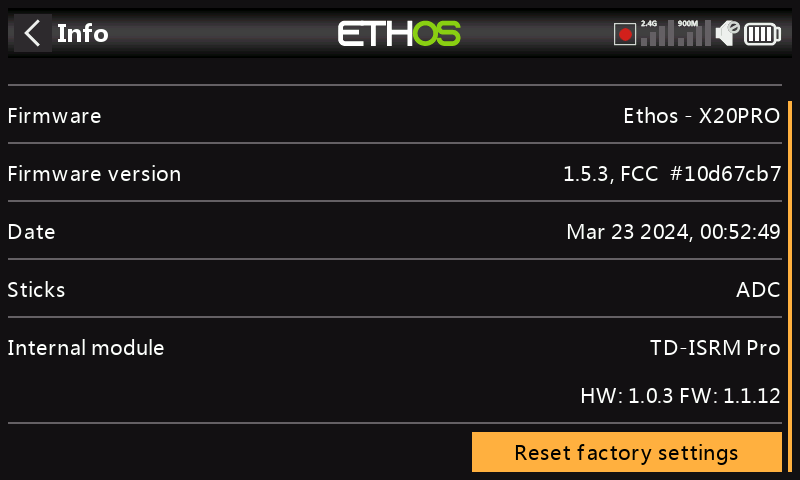

# Information

.jpeg>)

La page d'informations affiche des informations sur le micrologiciel du système, le type de cardan, la version du micrologiciel du module interne, le micrologiciel du récepteur ACCESS, TD ou TW et des informations sur le module externe.

**X18 et X20**

.png>)

**Numéro de série**

Numéro de série de la radio.

**Firmware**

Ethos, firmware, et type de radio (par exemple X20).\

**Version du firmware**

Version et type actuels du micrologiciel, par exemple FCC, LBT ou Flex.

**Date**

Date et heure de la version du micrologiciel.

**Erreurs**

.png>)

Lorsqu'ETHOS détecte une erreur, une icône d'avertissement d'erreur en triangle rouge s'affiche dans la barre supérieure de la vue principale.

Les erreurs peuvent être dues à :

**Erreurs de script Lua**\
**Les problèmes liés au script Lua entraîneront des messages d'erreur.**\

**RAM backup error (erreur Mémoire de sauvegarde)**\
**Un modèle peut être si énorme qu'il dépasse la RAM de sauvegarde. ETHOS a maintenant étendu l'espace RAM pour la sauvegarde des modèles de 4k à 32k, il est donc peu probable qu'il soit dépassé maintenant. Il s'agit d'une erreur majeure qui ralentira le chargement du modèle en mode d'urgence à partir de la carte SD au lieu de la RAM de secours.**\

**Exécution d'une version nocturne (version de test) du firmware**\
**Si une version de test du firmware a été chargée, l'icône d'avertissement sert à rappeler à l'utilisateur que les versions nocturnes ne sont pas destinées à voler.**\

**Manches**

La version capteur à effet Hall à cardan installée. L'ADC est pour l'analogique.

**Module interne**

Détails du module RF interne, y compris les versions du matériel et du micrologiciel.

.jpeg>).jpeg>)

**Récepteur**

Les détails du récepteur lié sont affichés après le module interne. Si un récepteur redondant est lié au même emplacement que le récepteur principal, les détails du récepteur s'affichent alternativement à l'écran. L'exemple ci-dessus montre un Archer SR10 Pro et son R9MM-OTA redondant est illustré par rapport aux détails du récepteur1.

**Module externe**

Détails de tout module RF FrSky externe (le cas échéant), y compris les versions du matériel et du micrologiciel si le protocole ACCESS.

Les multimodules ne sont pas affichés.

**Réinitialiser les paramètres d'usine**

Permet de rétablir les paramètres d'usine de la radio. Aucune connexion USB PC n'est nécessaire, c'est tout fait à la radio.

.png>)

Lorsque vous confirmez que vous souhaitez réinitialiser les paramètres d'usine, la radio efface tous les modèles, les fichiers journaux, les captures d'écran, les documents, les scripts, les bitmaps et les paramètres de la radio.\

.png>)

Il y a une barre de progression pendant le processus d'effacement. Il démontera ensuite tous les lecteurs et redémarrera la radio.

**X20 Pro/R/RS**

\

Informations similaires pour la X20 Pro/R/RS.
