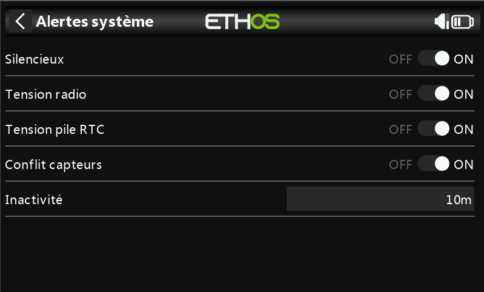

# Manches

.png>)

.jpeg>).jpeg>)

Sélectionnez votre mode de manche préféré. Le mode 1 a la manette des gaz et les ailerons sur le manche droit, et la profondeur et la gouverne de direction sur le manche gauche. Le mode 2 a la manette des gaz et la gouverne de direction sur le manche gauche, et l'aileron et la profondeur sur la droite.

Par défaut, les manches sont nommés comme indiqué ci-dessus pour les modes de manche standard de l'industrie. Ils peuvent être renommés à volonté.

**Ordre des voies**

L'ordre des voies définit l'ordre dans lequel les quatre entrées de baguettes sont affectées aux voies dans les mixages lorsqu'un nouveau modèle est créé par les assistants. L'ordre par défaut est APGD (AETR). S'il y en a plus d'un de chaque type de surface, ils seront regroupés à moins que les quatre premières voies ne soient fixes, voir ci-dessous. Par exemple, pour 2 ailerons, l'ordre des voies sera AAPGD (AAETR).

**quatre premières voies fixes**

 .jpeg>)

Lorsque cette option est activée, le regroupement des voies ne se produit pas sur les quatre premières voies. Si l'ordre des voies est APGD (AETR), l'assistant créera un modèle adapté aux récepteurs stabilisés SRx. Par exemple, un modèle avec 2 ailerons, 1 gouverne de profondeur, 1 moteur, 1 gouvernail de direction et 2 volets sera créé avec un ordre de canal APGDAFF (AETRAFF). Si cette option n'est pas activée, l'ordre des voies sera AAPGDFF (AAETRFF).
