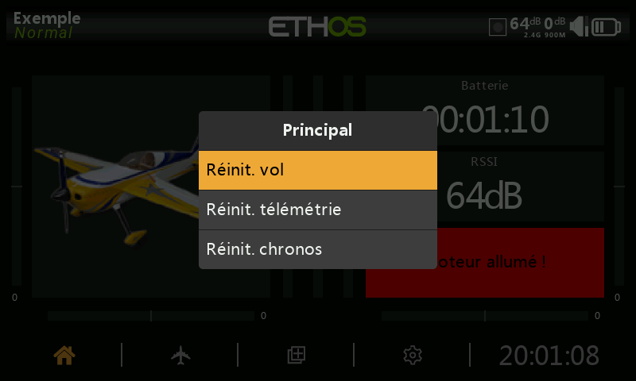
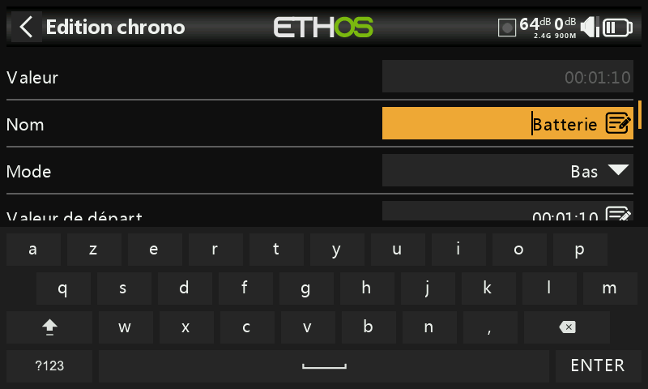

# Interface utilisateur et navigation

La radio dispose d'un écran tactile, ce qui rend l'interface utilisateur assez intuitive. En touchant les boutons correspondannts, les onglets Configuration du modèle (icône Avion), Configurer les écrans (icône Écrans multiples) et Configuration du système (icône Engrenage) vous permettent d'accéder directement à ces fonctions, qui sont décrites dans ces sections du manuel. Il est également possible d'y accéder à l'aide des touches \[MDL], \[DISP] et \[SYS] respectivement.

Alternativement, le sélecteur rotatif peut être utilisé pour déplacer la surbrillance vers la tuile ou le paramètre souhaité, puis appuyez sur Entrée pour le sélectionner.

Un appui long sur la touche \[RTN] vous ramènera à l'écran d'accueil à partir de n'importe quel sous-menu.

En touchant l'heure système à droite de la barre inférieure, vous accédez à la section Date et heure, qui vous permet de régler l'heure et la date.

Appuyez sur les icônes du haut-parleur ou de la batterie dans la barre supérieure pour afficher le son et le vibreur correspondants. et Panneaux de commande de la batterie.

### Menu de réinitialisation

Un appui long sur la touche \[ENT] depuis l’écran d’accueil fait apparaître un menu de réinitialisation

<figure><figcaption></figcaption></figure>

#### **Réinitialiser le vol**

Réinitialiser le vol réinitialisera la télémétrie, les chronos et les inters de fonction. Notez que les vérifications en amont seront effectuées après un vol de réinitialisation.

#### **Réinitialiser les données de télémétrie**

Réinitialise les données de télémétrie.

#### **Réinitialiser les chronos**

Réinitialisera les chronos.

### Verrouiller l'écran tactile

L'écran tactile LCD peut être verrouillé pour éviter toute opération inadvertance, en appuyant sur \[ENTER] et \[PAGE] simultanément pendant 1 seconde à partir de l'écran d'accueil. C’est également faisable en tant que fonction spéciale.

### Commandes d'édition

#### **Clavier virtuel**

Ethos fournit un clavier virtuel pour l'édition des champs de texte.

<figure><figcaption></figcaption></figure>

Il suffit d'appuyer sur n'importe quel champ de texte (ou de cliquer sur \[ENT]) pour faire apparaître le clavier.

<figure><figcaption></figcaption></figure>

Appuyez sur la touche « ?123 » ou « abc » pour basculer entre les claviers alphabétiques et numériques. Il y a aussi un verrou en majuscules pour saisir des lettres majuscules.
