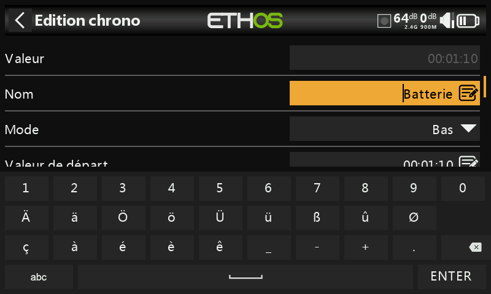

# Les différents modes de connexion USB

### Connexion en mode hors tension (radio éteinte)

La connexion de la radio, lorsqu'elle est éteinte, à un PC via un câble USB est le mode DFU pour flasher le chargeur de démarrage.

### Connexion mode bootloader

La radio est placée en mode bootloader en allumant la radio avec la touche Entrée enfoncée. Le message d'état 'Bootloader' s'affichera à l'écran.

La radio peut ensuite être connectée à un PC via un câble de données USB. Le message d'état passera à « USB Plugged » et le PC devrait afficher deux disques externes connectés. Le premier concerne la mémoire flash de la radio et le second le contenu de la carte SD ou eMMC.

Ce mode est utilisé pour la lecture et l'écriture de fichiers sur une carte SD ou eMMC et/ou la mémoire flash de la radio.

Ce mode peut également être utilisé pour se connecter à Ethos Suite afin de mettre à jour la radio. Veuillez-vous référer au mode Bootloader dans la section Ethos Suite.

### Mode de mise sous tension

Si la radio est connectée à un PC via un câble de données USB alors qu'elle est sous tension, la boîte de dialogue suivante s'affiche

<figure><figcaption>
Options de connection USB
</figcaption></figure>

* En mode joystick, la radio peut être configurée pour contrôler les simulateurs RC.

* En mode Frsky Suite, la radio entrera en « mode Ethos » pour communiquer avec Ethos Suite. Veuillez-vous référer au mode Ethos dans la section Ethos Suite.

* En mode Serial ... TODO
