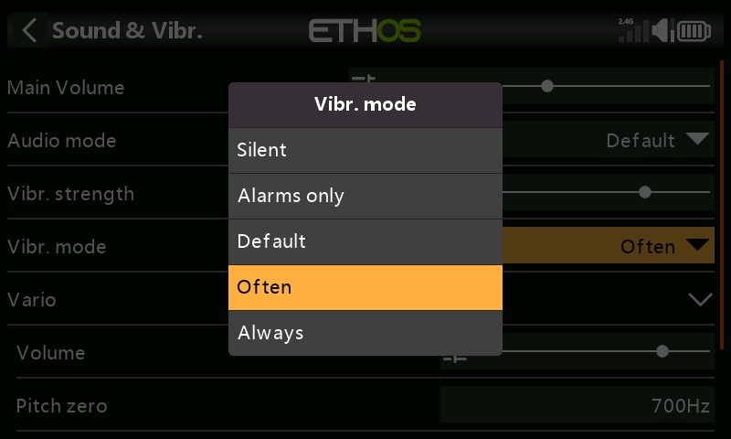

# test1

**Vario**

.png>)

Les caractéristiques audio des tonalités vario peuvent être configurées ici.

_**Volume**_

Le volume relatif de la tonalité vario.

_**Tonalité zéro**_

La tonalité lorsque le taux de montée est nul.

_**Tonalité max**_

La tonalité à la vitesse de montée maximale.

_**Répétition**_

Le délai entre les bips à la tonalité zéro.

Reportez-vous au capteur VSpeed dans Télémétrie et à la fonction spéciale Lire vario pour d'autres paramètres Vario.

**Vibration**

.png>)

_**Intensité**_

Utilisez le curseur pour contrôler l'intensité des vibrations haptiques.

_**Mode**_

Similaire au mode audio ci-dessus.

**Barre d'infos sup**

.jpeg>)

_**Tension numérique (volts)**_

L'état de la batterie dans la barre d'outils supérieure peut être modifié à partir de l'affichage de la barre par défaut pour afficher la tension de la batterie radio sous forme de valeur numérique à la place.

_**RSSI numérique**_

De même, l'état RSSI peut être modifié d'un affichage à barres à une valeur numérique pour 2,4G et 900M.

**Sélectionnez le modèle à la mise sous tension**

.jpeg>)

Lorsque cette option est activée, l'écran de sélection du modèle s'affiche à la mise sous tension, de sorte qu'un modèle peut être choisi avant que les alertes de la liste de contrôle du modèle précédemment sélectionné ne s'affichent. Cela évite d'avoir à annuler les alertes de la liste de contrôle avant de sélectionner un autre modèle.

Par défaut, le dernier modèle utilisé dans la session précédente est mis en surbrillance pour la sélection.
