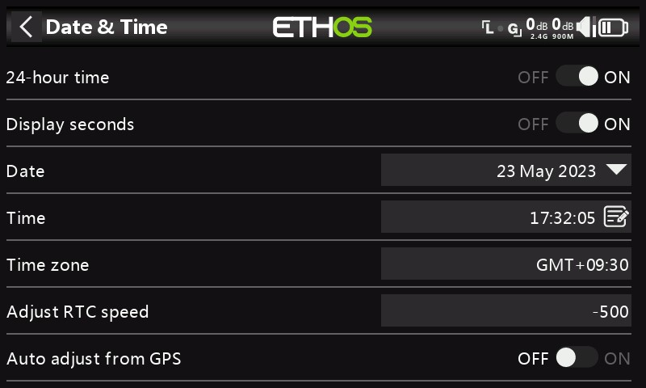
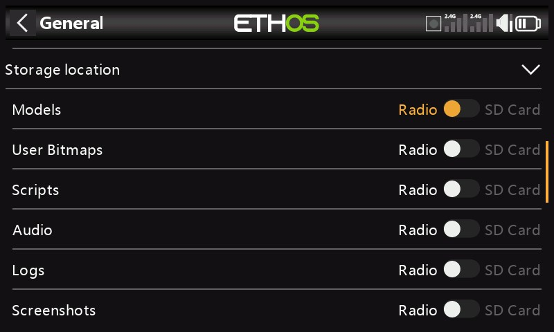
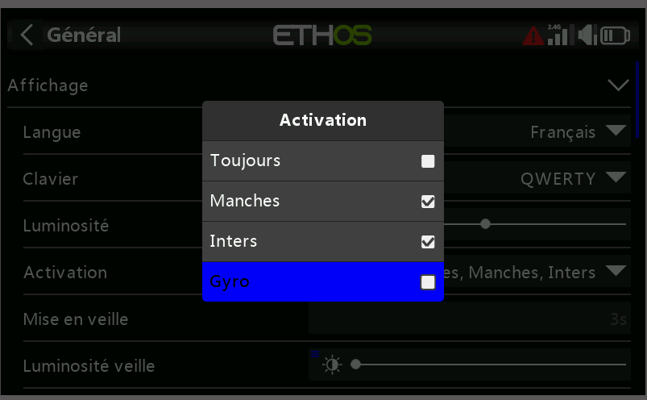
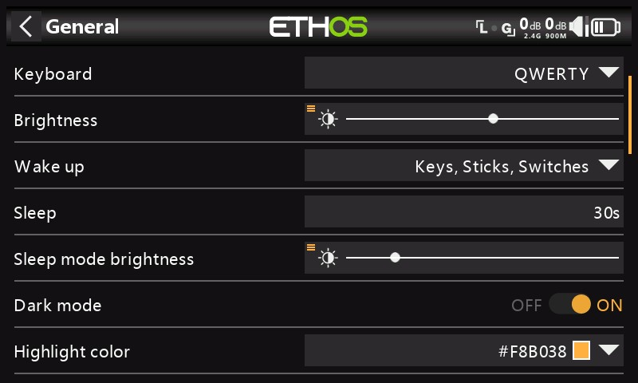
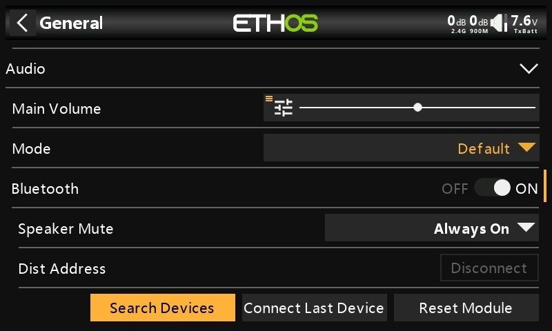
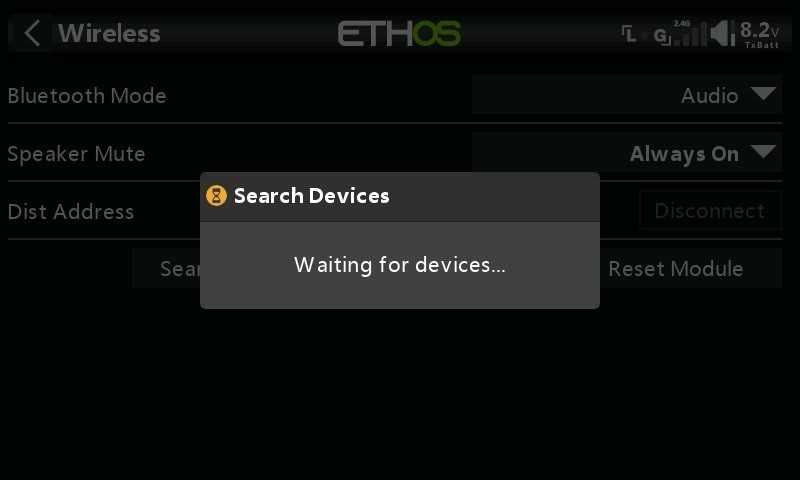

# test1

**Partage de fichiers via Bluetooth**

ETHOS dispose d'une fonction de transfert de fichiers Bluetooth radio-radio.

Sur la radio de réception, à l'aide du Gestionnaire de fichiers, accédez au dossier du modèle dans lequel vous souhaitez recevoir le modèle. Appuyez longuement sur Entrée et sélectionnez « Recevoir le fichier ici ».

Sur la radio qui envoie, accédez au fichier que vous souhaitez envoyer et appuyez dessus. Sélectionnez ensuite « Envoyer le fichier » et suivez les instructions sur les deux radios.

Si la radio est déjà connectée à un autre appareil Bluetooth sous Télémétrie / Bluetooth ou Trainer / Mode de liaison / Bluetooth ou Général / Audio / Bluetooth (X20S/Pro uniquement), il vous sera demandé si vous souhaitez déconnecter cet appareil.

#### Alertes 

(fr)(fr)

Les alertes système sont les suivantes :

**Mode silencieux**

Une alerte « Mode silencieux » sera émise au démarrage lorsque la vérification « Mode silencieux » est activée et que le « Mode audio » a été réglé sur Silencieux en mode Système / Général / Audio

**Tension principale**

Une alerte vocale « La batterie de la radio est faible » est émise lorsque la vérification de la « Tension principale » est activée et que la batterie de la radio principale est inférieure au seuil défini dans le paramètre « Basse tension » dans Système / Batterie.

**Tension pile RTC**

Une alerte vocale « La batterie RTC est faible » sera émise lorsque la vérification de la « tension RTC » est activée et que la pile bouton RTC est inférieure à 2,5 V, le seuil de batterie RTC par défaut. Il peut être éteint jusqu'à ce que la batterie RTC ait été remplacée, mais ne doit pas être laissé éteint indéfiniment. Le temps réel est utilisé dans l'enregistrement des données, et une heure invalide entraînera des difficultés dans la lecture des journaux, en particulier pour distinguer les sessions de vol.

**Avertissement de conflit de capteur**

La détection des conflits de capteurs peut être désactivée. Cela ne devrait être nécessaire que si vous avez des capteurs qui ne répondent pas à la spécification S.Port.

**Inactivité**

Une alerte vocale « Radio inactive » sera émise lorsque la radio n'a pas été utilisée pendant plus longtemps que la durée « Inactivité », ainsi qu'une vibration au cas où le volume de la radio serait complètement baissé. La valeur par défaut est de 10 minutes.

#### Date et heure 

Les paramètres de date et d'heure sont les suivants :

**Délai de 24 heures**

L'horloge s'affiche au format 24 heures lorsqu'elle est activée.

**Affichage des secondes**

L'horloge affichera les secondes lorsqu'elle sera activée.

**Date**

Doit être défini sur la date du jour. Ceci est utilisé dans les journaux.

**Heure**

Doit être réglé sur l'heure actuelle. Ceci est utilisé dans les journaux.

**Fuseau horaire**

Permet de configurer le fuseau horaire de l'utilisateur.

**Ajuster la vitesse RTC**

L'horloge en temps réel peut être calibrée pour compenser toute dérive de l'horloge, jusqu'à 41 secondes par jour.

Pour l'étalonnage, calculez combien de secondes votre horloge gagne ou perd en 24 heures.

Réglez la valeur d'étalonnage sur 12 fois ce nombre de secondes, ce qui la rend négative si votre horloge est rapide et positive si elle est lente. Pour une meilleure précision, vous pouvez ensuite vérifier si votre horloge est précise et ajuster légèrement la valeur d'étalonnage. La valeur d'étalonnage réelle peut être réglée entre -500 et +500.

**Réglage automatique à partir du GPS**

Lorsqu'elle est activée, l'heure et la date seront automatiquement réglées à partir des données du capteur GPS à distance.

#### Généralités 

Les éléments suivants peuvent être configurés ici :

* Attributs de l'écran LCD
* Les paramètres audio
* Les réglages vario
* Les paramètres de retour haptique
* La barre d'outils supérieure

**Attributs d'affichage**

Les attributs de l'écran LCD peuvent être configurés ici :

**Langue**

Les langues suivantes sont prises en charge pour les menus d'affichage :

* English
* 中文
* Česky
* Deutsch
* Español
* Français
* עִברִית
* Italiano
* Nederlands
* Norsk
* Português Brasileiro
* Polish
* Português

**Clavier**

Permet de choisir entre les dispositions de clavier virtuel QWERTY, QWERTZ et AZERTY.

**Luminosité**

Utilisez le curseur pour contrôler la luminosité de l'écran, de gauche à droite pour régler la luminosité de sombre à clair. Appuyez longuement sur \[ENT] pour afficher les options permettant d'utiliser une source ou de la régler au minimum ou au maximum.

Veuillez noter que si Luminosité (pour le rétroéclairage activé) = « Luminosité du mode veille » (pour le rétroéclairage désactivé), l'écran tactile reste actif.

**Option potentiomètre**

Appuyez sur « Utiliser une source », puis sélectionnez un potentiomètre à utiliser comme contrôle de la luminosité.

L'exemple ci-dessus montre que la luminosité est contrôlée via le potentiomètre 1.

**Mise en veille**

(fr)

Le rétroéclairage de l'écran peut être réveillé de l'état de veille conformément à une ou plusieurs des options suivantes :

_**Toujours**_

Le rétroéclairage reste allumé en permanence.

_**Manches**_

Le rétroéclairage s'allume lorsque vous actionnez des manches ou des touches.

_**Inters**_

Le rétroéclairage s'allume lorsque des interrupteurs ou des touches sont actionnés.

**Gyro**

Le rétroéclairage s'allume lorsque vous inclinez la radio ou lorsque vous actionnez les touches.

Notez que plusieurs options peuvent être activées.

_**Veille**_

Durée d'inactivité avant la désactivation du rétroéclairage. Lorsque vous sélectionnez « Toujours » comme option d'affichage « Réveil », l'option Veille est grisée.

**Luminosité du mode veille**

(fr)

Utilisez le curseur pour contrôler la luminosité de l'écran en mode veille, de gauche à droite pour régler la luminosité de sombre à clair.

Veuillez noter que si Luminosité (pour le rétroéclairage activé) = « Luminosité du mode veille » (pour le rétroéclairage désactivé), l'écran tactile reste actif.

_**Mode sombre**_

Permet de choisir entre les modes clair et sombre pour l'affichage.

**Couleur de surbrillance**

Permet de sélectionner la couleur de surbrillance à utiliser dans l'affichage. La valeur par défaut est jaune (#F8B038).

**Emplacement de stockage (X18 et X20 Pro/R/RS)**

Les radios X18 et X20 Pro/R/RS disposent d'une carte eMMC (MultiMediaCard intégrée) de 8 Go qui est un périphérique de stockage composé d'une mémoire flash NAND et d'un simple contrôleur de stockage. Le système ETHOS sélectionne par défaut le stockage eMMC, ce qui rend l'utilisation de la carte SD facultative. Cependant, l'utilisateur peut choisir l'utilisation du stockage eMMC ou utiliser une carte SD en option ou une combinaison des deux.

Veuillez-vous référer à l'écran de sélection de l'emplacement de stockage ci-dessus. Si le système et les modèles sont déplacés vers la carte SD, ces dossiers et fichiers doivent être copiés sur la carte SD avant d'effectuer la sélection. Il en va de même pour l'audio et les bitmaps.

**Paramètres audio**

(fr)

**Langue audio**

Permet de sélectionner la langue des annonces vocales.

**Choix des voix**

La fonction de système multi-voix offre la possibilité de choisir parmi différents ensembles de voix dans une langue donnée.

Voice 1 (main)

La voix principale est utilisée pour toutes les annonces système qui font partie du système d'exploitation Ethos. Par défaut, pour le français, vous avez le choix entre une voix féminin et une voix masculine. Ces packs ne couvrent que les annonces système.

Dans l'exemple ci-dessus, la voix féminine a été sélectionnée comme 'Voix 1 (principale)'.

Les fichiers se trouvent dans les dossiers suivants :

audio/_fr/femme/system_\
_audio/fr/homme/system_

Fichiers audio de l'utilisateur

Les fichiers audios de l'utilisateur peuvent être installés pour être utilisés avec la fonction spéciale « Lire audio » (auparavant « Lire la piste » et « Lire la séquence »). Leur emplacement doit être :

_Audio/fr/femme_ ou\
_audio/fr/homme_

Voix 2 et 3

Des packs de voix alternatives peuvent être installés en tant que Voice 2 ou 3.

Pour garantir la sortie vocale appropriée pour Voice 2 ou 3, vous devrez ajouter vos fichiers audio personnalisés à une structure de dossiers similaire à celles standard présentées ci-dessus sous Voice 1. Par exemple, si vous utilisiez TTS et une voix appelée Susan, votre structure de dossiers serait la suivante :

_audio/fr/Susan_ pour les fichiers audio de l'utilisateur

_audio/fr/Susan/système_ pour les fichiers audio du système de remplacement

Veuillez noter que chaque voix doit avoir un dossier /system, contenant les fichiers audio nécessaires pour les annonces de la valeur de jeu et de le chrono. Notez qu'une liste des fichiers audio système fournis en standard est incluse sous forme de fichier .csv avec chaque version audio.

Vous pouvez ensuite choisir la voix à utiliser pour chaque chrono et la fonction spéciale « Lire audio ». Si vous le souhaitez, vous pouvez attribuer une voix personnalisée en tant que voix 1 (principale) si vous souhaitez remplacer les annonces système par la vôtre.

Voice par ‘défaut’

Pour éviter les problèmes de conversion à partir de la version 1.4.X, une voix par défaut est également installée. Lors de l'installation/de la mise à niveau, si la voix audio du système 1 (voix principale) n'a pas déjà été définie, alors 'Voix 1 (principale)' sera définie sur 'default', car il est certain que le dossier existe.

Les fichiers se trouvent dans ce dossier:

a_udio/fr/default/system_

Fichiers audios de l'utilisateur

Certains fichiers audios personnalisés couramment demandés sont fournis pour être utilisés avec la fonction spéciale « Lire audio » (auparavant « Lire la piste » et « Lire la séquence »). Leur emplacement est :

_audio/fr/default/_

_D'autres fichiers audio utilisateur personnalisés peuvent être ajoutés à ce dossier si l'utilisateur souhaite continuer à utiliser cette voix par défaut._

**Volume principal**

Utilisez le curseur pour contrôler le volume audio. Un appui long sur \[ENT] permet d'utiliser un potentiomètre. Les bips pendant le réglage aident à juger du volume.

**Mode audio**

(fr)

**Silencieux**

Pas d'audio. Notez qu'une alerte sera émise au démarrage si la vérification du « mode silencieux » dans Système / Alertes est activée.

_**Alarmes uniquement**_

Seules les alarmes seront émises sur l'audio.

_**Par défaut**_

Les sons sont activés.

**Fréquent**

Il y aura également des bips d'erreur lorsque vous tenterez de dépasser la valeur maximale ou minimale sur les nombres modifiables.

**Toujours**

En plus des sons dans « Souvent », il y aura également des bips lorsque le menu est navigué.

**Bluetooth (X20S/HD/Pro/R/RS)**

Les modèles X20S, HD et X20 Pro/R/RS disposent d'un mode audio supplémentaire pour relayer l'audio vers un appareil Bluetooth comme un casque.

Appuyez sur « Rechercher des appareils ».

Le message « En attente d'appareils » s'affiche. Allumez votre appareil Bluetooth et placez-le en mode d'appairage.

Une fois le périphérique Bluetooth trouvé, son nom s'affiche. Touchez-le pour sélectionner l'appareil.

Le message « En attente de l'appareil » s'affiche.

Lorsque la radio et l'appareil sont couplés, le message « Appareil Bluetooth connecté » s'affiche. Appuyez sur OK.

L'écran Bluetooth s'affichera à nouveau.

**Mise en sourdine du haut-parleur**

Pour couper le son du haut-parleur du système (par exemple lors de l'utilisation d'un écouteur BT), sélectionnez l'option Toujours allumée, ou activée uniquement lorsque la télémétrie est active, ou contrôlée par une source telle qu'un inter ou toute autre condition.

Le système se souvient de l'appareil Bluetooth. Pour un fonctionnement normal, allumez la radio, puis l'appareil Bluetooth. L'appareil Bluetooth se connectera, ce qui prendra quelques secondes pour que la sourdine du haut-parleur s'active à nouveau.

