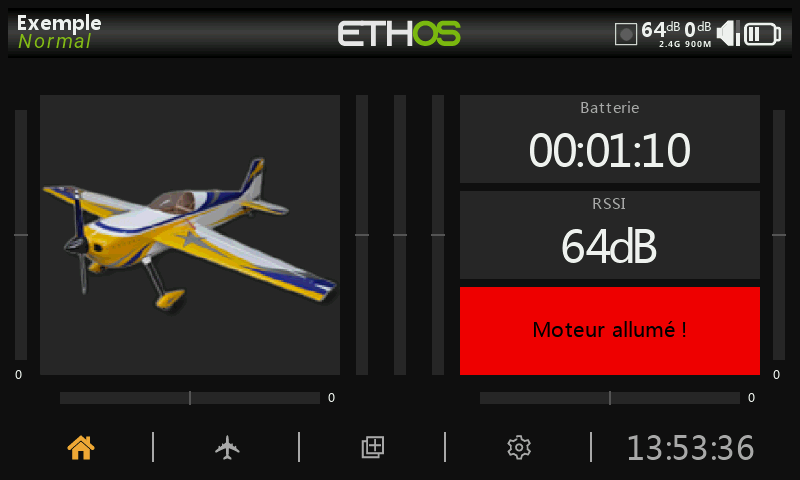

# Vues principales

## Vues principales

Ethos permet à l'utilisateur une grande flexibilité dans l'affichage de différentes vues. Dans un premier temps, seules les informations de base présentées ci-dessous sont affichées, jusqu'à ce que l'utilisateur personnalise ou ajoute des vues et des widgets à afficher. Notez qu'il est possible de définir jusqu'à 12 vues principales.

Les vues principales partagent normalement les barres supérieure et inférieure, mais d'autres options sont possibles, voire même configurables par l'utilisateur. Reportez vous à la section Configurer les écrans pour plus de détails sur la configuration des affichages et la programmation LUA.

### La barre supérieure

<figure><figcaption>
Barre supérieure
</figcaption></figure>

La barre supérieure affiche le nom du modèle sur la gauche, ainsi que la phase de vol active si ces dernières sont utilisées. Sur la droite se trouvent des icônes pour :

* l'enregistrement des données
* l'écolage (maître ou l'élève selon le cas)
* RSSI 2.4G
* RSSI 900M
* le volume sonore
* l'état de la batterie radio

Un appui sur les icônes du haut-parleur ou de la batterie permet d'accéder aux options Général ou Batterie de la radio.

#### Avertissement d'erreur

Une icône d'avertissement d'erreur en triangle rouge s'affiche dans la barre supérieure de la vue principale lorsque ETHOS détecte une des erreurs suivantes:

* Erreurs de script Lua
* Erreur de sauvegarde de la RAM
* Exécution d'une version de test du firmware non utilisable pour le vol.

Les détails relatifs à l'avertissement sont affichés dans la page Système / Infos. Veuillez vous référer à la section Erreurs.

### La barre inférieure

La barre inférieure comporte quatre icones pour accéder aux fonctions suivantes,de gauche à droite : Ecran d'accueil du modèle, Configuration du modèle, Configurer les écrans du modèle et Configuration du système. L'heure système s'affiche à droite. Un appui sur l'heure permet d'accéder aux options de date et d'heure de la radio.
